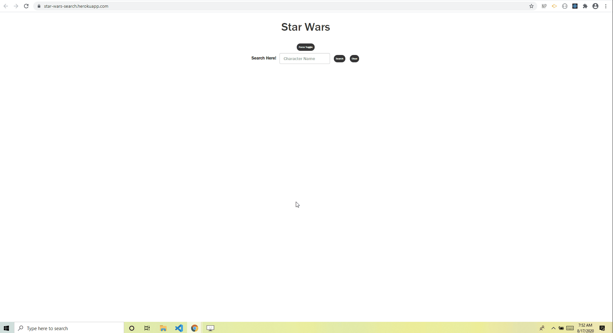

# Star Wars Search
###### Description
This app is for the Star Wars enthusiast who wants to learn more about the characters they love.  

[Click here to live link](https://star-wars-search.herokuapp.com/)

## Contributors
* mwturner611

## Technology
Node.JS, Express, Heroku, React, Reactstrap, JavaScript, HTML, CSS and Axios 

## Table of Contents
* [Top of Page](#description)
* [Technologies Used](#technologies)
* [Usage](#usage)
* [License](#license)
* [Contributing](#contributing)
* [Contacts](#contacts)

## Demo
<!--  -->

## Usage 
1. Please use the search bar to find a star wars character
2. Select your force "light" or "dark" to experience the page
3. See the facts about your returned character and click "more" to see Star Ships Flown and Movies with the character
4. Repeat and enjoy

## Kudos
Blessing Krofegha for his article on Dark Mode in React [here.](https://www.smashingmagazine.com/2020/04/dark-mode-react-apps-styled-components/)

## License
This project is licensed under The MIT License (MIT).

## Contributing Guidelines
All contributions and suggestions are welcome! For direct contributions, please fork the repository and file a pull request.

## Contacts
* Name: Matt Turner (@mwturner611)
* e-mail: mwturner611@gmail.com
* LinkedIn: https://www.linkedin.com/in/matt-turner-ba328211a/*# quizzler